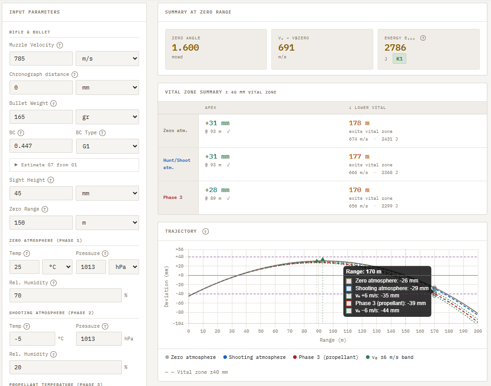
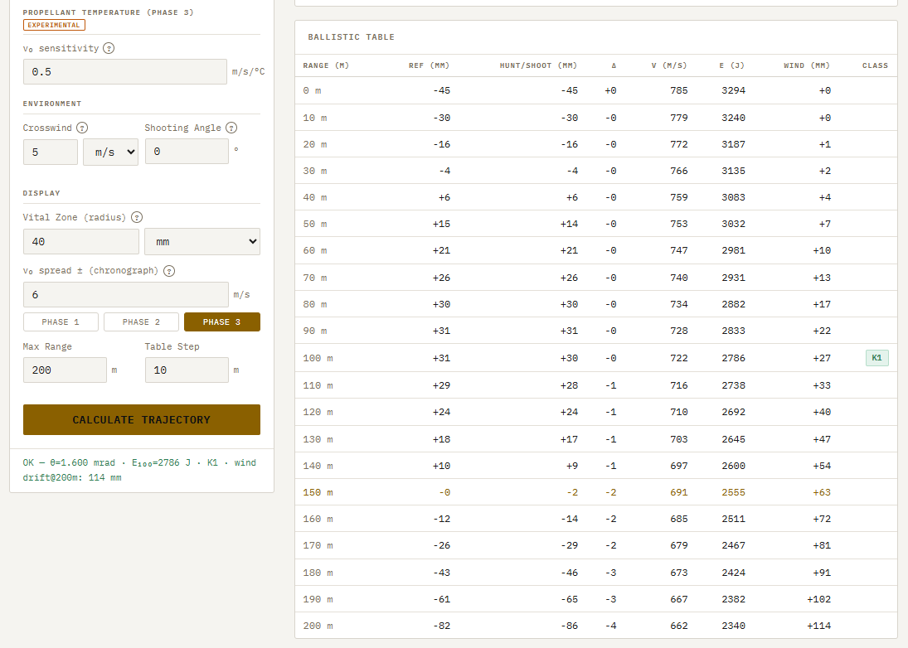

# Josef's External Ballistics Calculator

A free, browser-based external ballistics calculator for hunters and handloaders. No login, no ads, no install — just open and shoot.

**[Live calculator →](https://jsbartunek.github.io/josefs-external-ballistics/)**

---

## Features

- **Three-phase trajectory model** — separates the rifle's mechanical zero (Phase 1), atmospheric conditions on the day of the hunt (Phase 2), and propellant temperature effect on muzzle velocity (Phase 3), making each contribution explicit
- **G1 and G7 drag models** — Gehtsoft/BRL drag tables with π/8 (Siacci/Ingalls) normalization; G1↔G7 conversion built in with unified factor of 1.95 for all pointed boat-tail types based on modern Doppler/radar data
- **RK4 integration** — fourth-order Runge-Kutta with 1 ms timestep
- **Two independent atmospheres** — separate zero and shooting conditions (temperature, pressure, relative humidity) with Magnus formula humid-air density
- **Chronograph correction** — enter chronograph distance to back-calculate true muzzle velocity from measured speed
- **Wind drift** — lag-time method; chart shows drift across full range
- **Shooting angle correction** — uphill/downhill (rifleman's rule, g_eff = g·cos α)
- **Propellant temperature sensitivity** (Phase 3, experimental) — user-measured v₀/°C coefficient applied as Δv₀ = k·(T_shoot − T_zero)
- **Vital zone analysis** — apex height and position, drop-to-vital-zone crossing distance, and whether the bullet stays within the vital zone throughout the trajectory
- **v₀ spread band** — trajectory envelope for ±chronograph spread, selectable per phase
- **Sensitivity analysis** — quantifies how much v₀, temperature, pressure, and wind each affect impact at the selected range
- **Swedish hunt classes** — K1/K2/K3/K4 evaluated at 100 m per Naturvårdsverket regulations; displayed alongside E@zero in the summary panel
- **Zero-from-offset estimator** — enter a measured bullet impact at any distance to back-calculate the zero range; classifies the result as rising, peak, or falling trajectory
- **Optimize zero range for vital zone** — bisection search finds the zero range that maximizes MPBR for a given vital zone radius; one click applies the result
- **Trajectory and wind drift charts** — reference, shooting-day, and Phase 3 trajectories overlaid with vital zone lines
- **Ballistic table** — configurable range and step, all results in chosen units
- **SI and imperial units** — switch freely between m/s and fps, mm and in, hPa and inHg, m and yd
- **Mobile-friendly** — responsive layout, works on phone in the field
- **Settings persistence** — all inputs saved in localStorage

## Validation

Trajectory agrees with JBM Ballistics and QuickTARGET to within 10 mm (0.4 in) at 200 m (220 yd). Velocity agrees to within 0.5 m/s (1.6 fps), validated against JBM Ballistics and Norma factory data. Humid-air density validated at 15°C / 1013 hPa / 50% RH → ρ = 1.2211 kg/m³ (matches QuickTarget).

## Credits

- [JBM Ballistics](http://www.jbmballistics.com) — validation reference
- [QuickTARGET](https://www.quicktarget.net) — validation reference
- Norma — factory ballistic data used for validation
- Berger, Hornady, Nosler, Lapua — ballistic coefficient data and references
- Developed with the assistance of [Claude](https://www.anthropic.com) by Anthropic

## Companion tool

[Josef's Bullet Stability Calculator →](https://jsbartunek.github.io/josefs-stability-calculator/)

---

*Provided for informational and educational purposes only. Always verify results and follow applicable firearms laws and hunting regulations.*
